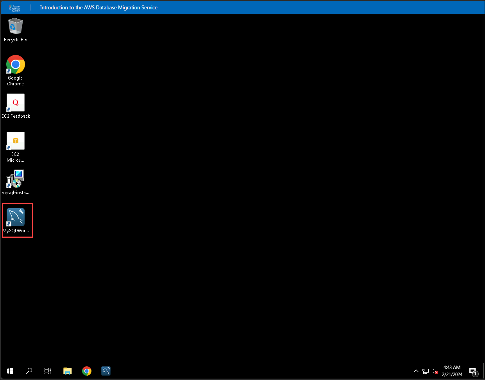
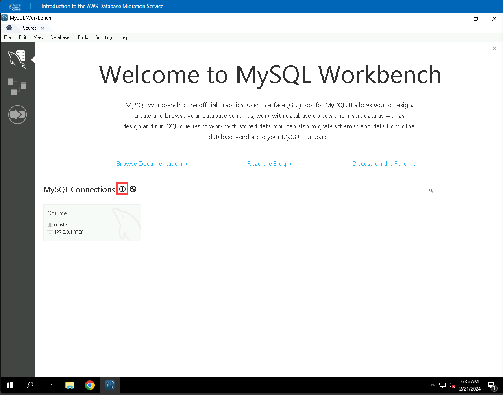
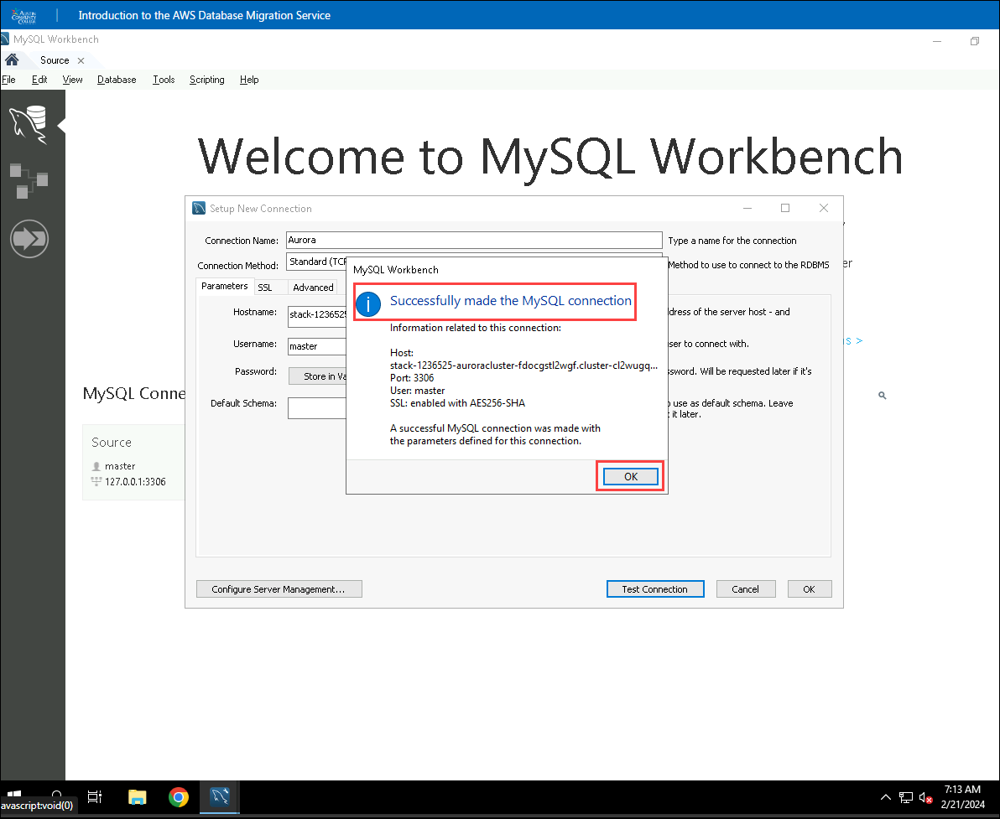
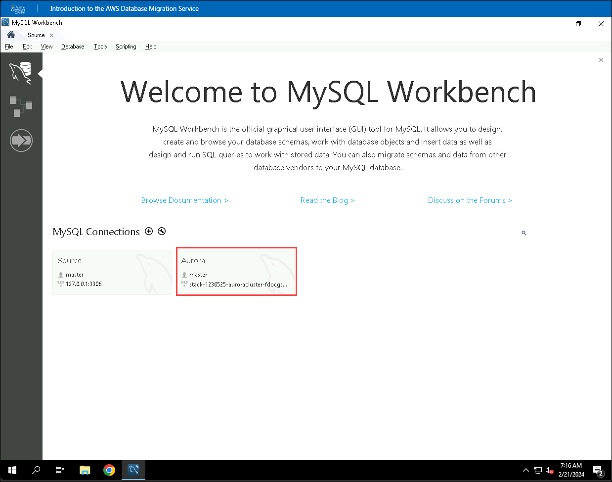
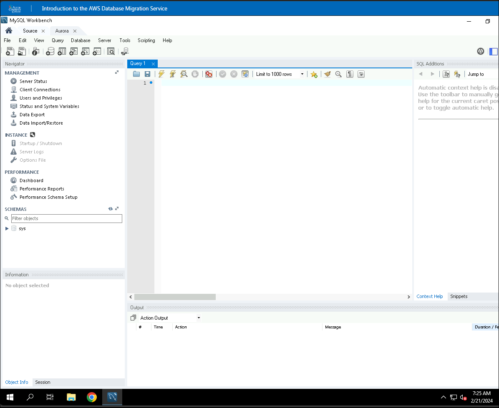
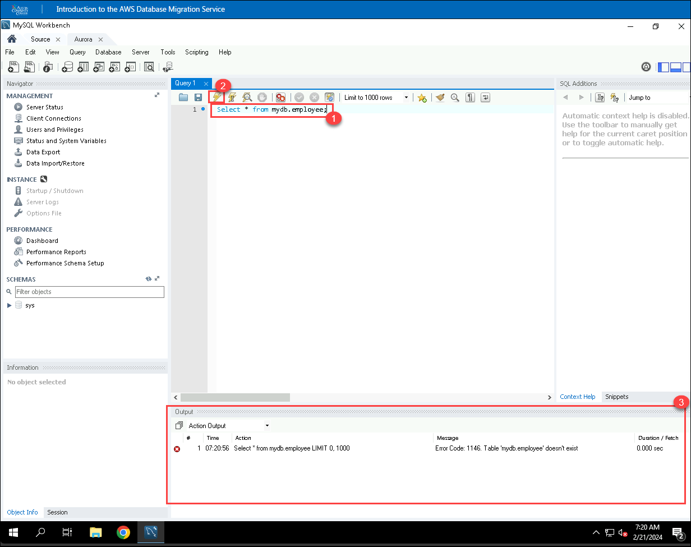

## Exercise 2: Use MySQL Workbench To Connect To Your Pre-Created RDS (Aurora) Instance.
In this exercise, you will be connecting your pre-created RDS (Aurora) Instance using the **MySQL Workbench Application**.

1. Open the MySQL Workbench Application on the LabVM, and on the MySQL Workbench homepage, click on the plus icon to add a new database connection.





2. Provide the below details in the opened Setup New Connection dialog box:

- **For the Connection Name, enter Aurora.**

- **For the Username, enter**

- **For the Hostname, enter cluster endpoint**

- **For the Password, click on Store in Vault and enter , and then click OK.**


3. Click on **Test Connection** to verify whether the connection with MySQL is successful or not, and then click OK.





4. Click **OK** to save the connection details and verify that the connection is named **Aurora**.


5. Double click on connection Aurora to open a **Query Editor**.





6. In the Query Editor, execute the following query to verify that no data exists in your Aurora instance.
```
Select * from mydb.employee;
```
You should receive a message showing that mydb.employee does not exist.



<question source ="https://raw.githubusercontent.com/Raghukashyap1143/raghu/main/Question2.md" />
